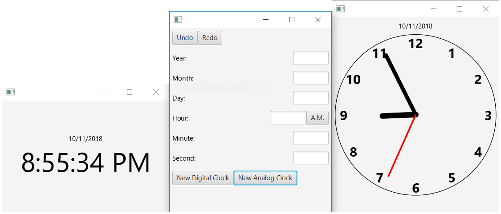

# Homework 2
Homework 2 is a JavaFX application consisting of an internal clock that the user can adjust using a menu. The time on the internal clock is reflected on any number of digital and analog clock faces the user can bring up with the click of a button.

Below is a sample screenshot of the application:

# Deployment Instruction

- Windows: run build.bat
- Mac/Linux: run build.sh
# How to Use 
Double-click on "HW2.jar" to launch the application.

To change an element of the internal time, type the numerical value of the desired element into the appropriate field and press Enter. For instance, to set the month to April, type "4" into the text box labelled "Month".

To open a clock face to reflect the internally-stored time, click one of the buttons at the bottom of the main screen. Both types of face show the date at the top, but while the digital clock face displays a numerical representation of the time at the bottom, the analog clock face shows a simple analog clock at the bottom.

Clicking the "Undo" button at the top of the main screen undoes the last action you performed, be it changing the internal clock or opening a new clock face. There is one exception, however: if you close a clock face using the standard desktop interface, attempting to undo the act of opening it will do nothing.

Clicking the "Redo" button at the top of the main screen redoes the last action you successfully undid.

To exit the application, close the main screen. Closing the main screen will also close any clock faces currently open.

# Design Methodology
Implementing the design patterns was very easy.

For the command pattern, I created one abstract class covering all commands in general, one abstract subclass covering commands that could be undone, and concrete subclasses for every action the user could need to perform.

For the MVC design pattern, I made it so that the model is unaware of anything, the views are aware of the controller, and the controller is aware of the model and the views.

To combine these two design patterns, I made it so that the views create commands that are issued to the controller. The controller assigns the appropriate targets to these commands, then executes them. Commands that can be undone are stored in a stack so that they can be undone and redone when requested. The controller only directly modifies the model by making it advance once every second. All other modifications to the model are relegated to commands created by the views.